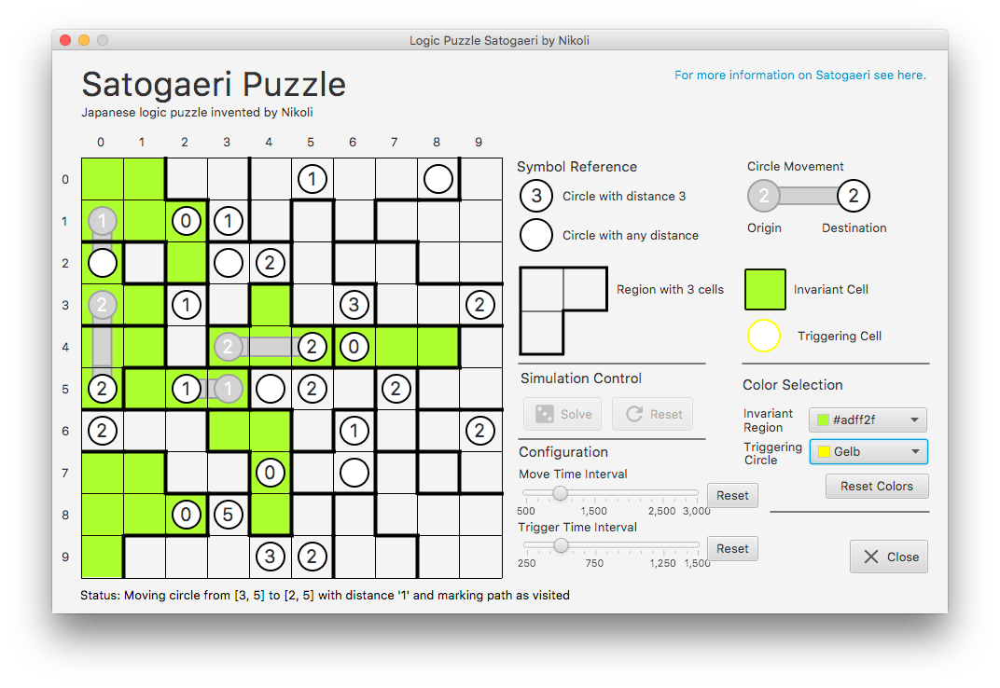

# Satogaeri Puzzle
**Satogaeri** (japanisch _Heimkehr_, _Homecoming_) ist ein japanisches Logikrätsel, erdacht von Ichinokoto und erstmals
publiziert in der Zeitschrift _Nikoli Vol. 99_ im Jahre 2002. Dabei geht es darum, Kreise auf einem Feld in sogenannte
**Regionen** zu bewegen, von denen am Ende nur jede einen Kreis beinhalten darf.

_Benutzeroberfläche der Simulation_

## Spielregeln
* Jeder Kreis auf dem Spielfeld hat eine festgelegte oder eine beliebige Distanz
  (gekennzeichnet durch die Zahl).
* Die fett umrandeten Felder sind **Regionen** (oder auch _Countries_).
* Die Kreise können sich horizontal und vertikal bewegen und müssen dabei
  die festgelegte Anzahl an Schritten passieren:
    * Kreise mit fester Distanz müssen genau so viele Schritte gehen
    * Kreise ohne Distanz können eine beliebige Anzahl an Schritten gehen
      oder auf ihrem Feld stehenbleiben (Schrittweite 0).
* Die Wege von Kreisen **dürfen sich nicht überschneiden**, d.h. kein Kreis
  darf eine Zelle betreten, die bereits besucht wurde.
* Am Ende muss jede Region **genau einen Kreis** beinhalten.

---

**Hinweis**: Die Screenshots von VisualVM befinden sich im Ordner [`vm-snapshots/`](vm-snapshots).

---

## Aufgabenstellung
* Implementierung einer technisch einwandfrei lauffähigen Applikation in Java 8.
* Graphische Benutzeroberfläche in **JavaFX**.
* Test der Implementierung mit **JUnit** und Gewährleistung der Funktionsweise.
* **Lösungsverfahren**: Backtracking, Genetische Algorithmen oder Ameisenalgorithmen.
* Nutzung leistungsfähiger Datenstrukturen und Optimierung der Performance mit **VisualVM**.

## Wichtige Hinweise:
* Pro Student wird eine Aufgabe bearbeitet.
* Die Zuordnung einer Aufgabe zu einem Studierenden erfolgt mit einem Zufallsgenerator.
* Nutzung der camelCase-Notation, um die Lesbarkeit zu vereinfachen.
* Zulässige externe Bibliotheken: junit-jupiter-api.jar und opentest4j.jar.
* Verwendung geeigneter englischer Begriffe für Namen und Bezeichnungen.
* Erstellung einer vollständigen und verschlüsselten 7-Zip-Datei unter Beachtung des Prozedere für die Abgabe von Prüfungsleistungen und der Namenskonvention.
* Zeitansatz: 35 Stunden
* Abgabetermin: Sonntag, 11.03.2018
* Bewertung: 20 Punkte
